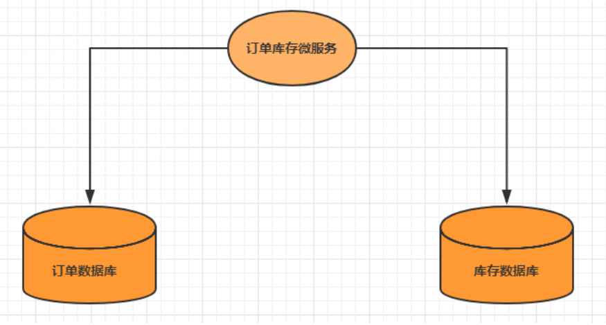

# 10.1分布式事务基础

## 10.1.1 事务&#x20;

事务指的就是一个操作单元，在这个操作单元中的所有操作最终要保持一致的行为，要么所有操作都成 功，要么所有的操作都被撤销。简单地说，事务提供一种“要么什么都不做，要么做全套”机制。

## 10.1.2 本地事务

本地事物其实可以认为是数据库提供的事务机制。说到数据库事务就不得不说，数据库事务中的四大特性:&#x20;

* A：原子性(Atomicity)，一个事务中的所有操作，要么全部完成，要么全部不完成&#x20;
* C：一致性(Consistency)，在一个事务执行之前和执行之后数据库都必须处于一致性状态&#x20;
* I：隔离性(Isolation)，在并发环境中，当不同的事务同时操作相同的数据时，事务之间互不影响&#x20;
* D：持久性(Durability)，指的是只要事务成功结束，它对数据库所做的更新就必须永久的保存下来

数据库事务在实现时会将一次事务涉及的所有操作全部纳入到一个不可分割的执行单元，该执行单元中 的所有操作要么都成功，要么都失败，只要其中任一操作执行失败，都将导致整个事务的回滚。

## 10.1.3 分布式事务&#x20;

分布式事务指事务的参与者、支持事务的服务器、资源服务器以及事务管理器分别位于不同的分布式系 统的不同节点之上。&#x20;

简单的说，就是一次大的操作由不同的小操作组成，这些小的操作分布在不同的服务器上，且属于不同 的应用，分布式事务需要保证这些小操作要么全部成功，要么全部失败。 本质上来说，分布式事务就是为了保证不同数据库的数据一致性。

## 10.1.4 分布式事务的场景&#x20;

### 单体系统访问多个数据库&#x20;

一个服务需要调用多个数据库实例完成数据的增删改操作

### 多个微服务访问同一个数据库&#x20;

多个服务需要调用一个数据库实例完成数据的增删改操作

.png>)

### 多个微服务访问多个数据库&#x20;

多个服务需要调用一个数据库实例完成数据的增删改操作

.png>)

